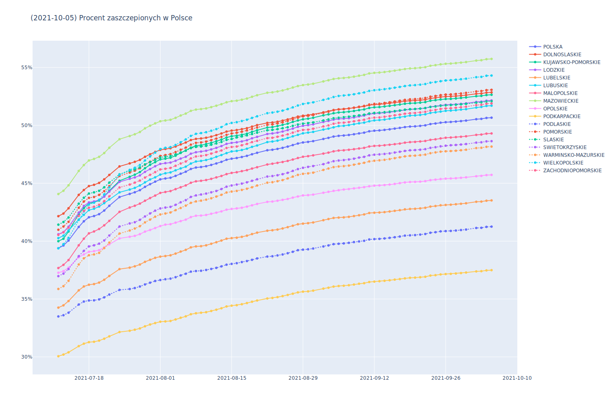

# Opracowanie na podstawie danych z https://www.gov.pl/web/szczepienia-gmin

```
WOJEWODZTWO         |      KIEDY ODPORNOSC STADNA 70%     
----------------------------------------------------------
DOLNOSLASKIE        | 0.3536%/dzien |  70 dni | 2021/09/29
KUJAWSKO-POMORSKIE  | 0.4297%/dzien |  61 dni | 2021/09/20
LODZKIE             | 0.3615%/dzien |  73 dni | 2021/10/02
LUBELSKIE           | 0.2675%/dzien | 125 dni | 2021/11/23
LUBUSKIE            | 0.3357%/dzien |  80 dni | 2021/10/09
MALOPOLSKIE         | 0.4099%/dzien |  70 dni | 2021/09/29
MAZOWIECKIE         | 0.3934%/dzien |  57 dni | 2021/09/16
OPOLSKIE            | 0.2429%/dzien | 126 dni | 2021/11/24
PODKARPACKIE        | 0.1679%/dzien | 229 dni | 2022/03/07
PODLASKIE           | 0.1831%/dzien | 191 dni | 2022/01/28
POMORSKIE           | 0.3704%/dzien |  70 dni | 2021/09/29
SLASKIE             | 0.3586%/dzien |  71 dni | 2021/09/30
SWIETOKRZYSKIE      | 0.3423%/dzien |  88 dni | 2021/10/17
WARMINSKO-MAZURSKIE | 0.3923%/dzien |  78 dni | 2021/10/07
WIELKOPOLSKIE       | 0.5175%/dzien |  51 dni | 2021/09/10
ZACHODNIOPOMORSKIE  | 0.3247%/dzien |  82 dni | 2021/10/11
----------------------------------------------------------
POLSKA              | 0.3617%/dzien |  76 dni | 2021/10/05

WOJEWODZTWO         | 2021/07/12 | 2021/07/13 | 2021/07/14 | 2021/07/16 | 2021/07/17 | 2021/07/18 | 2021/07/19 | 2021/07/20 | 2021/07/21 | 
-------------------------------------------------------------------------------------------------------------------------------------------
DOLNOSLASKIE        |   42.1557% |   42.3835% |   42.8385% |   43.9960% |   44.4158% |   44.7584% |   44.8667% |   45.0307% |   45.3385% | 
KUJAWSKO-POMORSKIE  |   39.9931% |   40.2098% |   40.8377% |   42.3454% |   42.8518% |   43.2487% |   43.3607% |   43.5067% |   43.8604% | 
LODZKIE             |   40.5948% |   40.7807% |   41.2447% |   42.4654% |   43.0400% |   43.3428% |   43.4272% |   43.5568% |   43.8479% | 
LUBELSKIE           |   34.2559% |   34.4537% |   34.8273% |   35.7477% |   36.0844% |   36.2342% |   36.2911% |   36.4204% |   36.6638% | 
LUBUSKIE            |   40.2608% |   40.4719% |   40.9276% |   41.8660% |   42.2746% |   42.6795% |   42.8006% |   42.9880% |   43.2825% | 
MALOPOLSKIE         |   37.6769% |   37.9514% |   38.3661% |   39.6385% |   40.2107% |   40.6725% |   40.8352% |   41.0506% |   41.3657% | 
MAZOWIECKIE         |   44.0694% |   44.3512% |   44.8225% |   46.0644% |   46.5689% |   46.9691% |   47.1015% |   47.2837% |   47.6100% | 
OPOLSKIE            |   37.2705% |   37.4065% |   37.7058% |   38.6102% |   38.8550% |   39.0812% |   39.1322% |   39.2208% |   39.4565% | 
PODKARPACKIE        |   30.0581% |   30.2031% |   30.3951% |   30.9303% |   31.1418% |   31.2739% |   31.3063% |   31.4053% |   31.5691% | 
PODLASKIE           |   33.4953% |   33.6003% |   33.8196% |   34.5223% |   34.7800% |   34.8734% |   34.8864% |   34.9681% |   35.1428% | 
POMORSKIE           |   40.9832% |   41.2639% |   41.6696% |   42.8810% |   43.4233% |   43.7364% |   43.8119% |   43.9950% |   44.3166% | 
SLASKIE             |   41.4244% |   41.6536% |   42.0422% |   43.2352% |   43.7482% |   44.1101% |   44.2136% |   44.3494% |   44.6515% | 
SWIETOKRZYSKIE      |   36.9768% |   37.1930% |   37.5898% |   38.7008% |   39.1595% |   39.5454% |   39.6394% |   39.7806% |   40.0575% | 
WARMINSKO-MAZURSKIE |   35.8693% |   36.1103% |   36.5717% |   37.9822% |   38.5148% |   38.7816% |   38.8516% |   38.9864% |   39.4003% | 
WIELKOPOLSKIE       |   39.3807% |   39.7380% |   40.2829% |   41.8345% |   42.5599% |   43.1536% |   43.3205% |   43.5727% |   44.0382% | 
ZACHODNIOPOMORSKIE  |   40.5365% |   40.7623% |   41.1608% |   42.1763% |   42.6110% |   42.8849% |   42.9747% |   43.1422% |   43.4585% | 
-------------------------------------------------------------------------------------------------------------------------------------------
POLSKA              |   39.3873% |   39.6262% |   40.0528% |   41.2269% |   41.7134% |   42.0630% |   42.1672% |   42.3302% |   42.6427% | 
```



