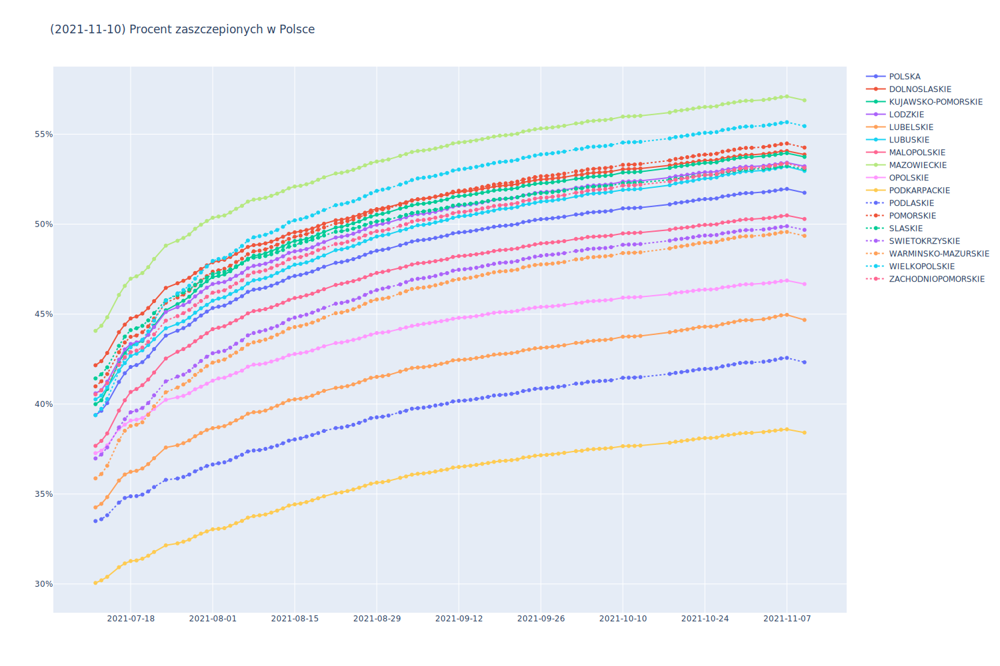

# Opracowanie na podstawie danych z https://www.gov.pl/web/szczepienia-gmin




```
WOJEWODZTWO         | 2021/08/05 |     KIEDY ODPORNOSC STADNA 70%      
-----------------------------------------------------------------------
DOLNOSLASKIE        |   48.3542% | 0.2583%/dzien |  84 dni | 2021/10/28
KUJAWSKO-POMORSKIE  |   47.6180% | 0.3177%/dzien |  71 dni | 2021/10/15
LODZKIE             |   47.1298% | 0.2723%/dzien |  84 dni | 2021/10/28
LUBELSKIE           |   39.0982% | 0.2018%/dzien | 154 dni | 2022/01/06
LUBUSKIE            |   46.2804% | 0.2508%/dzien |  95 dni | 2021/11/08
MALOPOLSKIE         |   44.6544% | 0.2907%/dzien |  88 dni | 2021/11/01
MAZOWIECKIE         |   50.8524% | 0.2826%/dzien |  68 dni | 2021/10/12
OPOLSKIE            |   41.7296% | 0.1858%/dzien | 153 dni | 2022/01/05
PODKARPACKIE        |   33.3815% | 0.1385%/dzien | 265 dni | 2022/04/27
PODLASKIE           |   37.0404% | 0.1477%/dzien | 224 dni | 2022/03/17
POMORSKIE           |   47.8940% | 0.2880%/dzien |  77 dni | 2021/10/21
SLASKIE             |   47.6622% | 0.2599%/dzien |  86 dni | 2021/10/30
SWIETOKRZYSKIE      |   43.3559% | 0.2658%/dzien | 101 dni | 2021/11/14
WARMINSKO-MAZURSKIE |   42.8632% | 0.2914%/dzien |  94 dni | 2021/11/07
WIELKOPOLSKIE       |   48.5440% | 0.3818%/dzien |  57 dni | 2021/10/01
ZACHODNIOPOMORSKIE  |   46.7055% | 0.2570%/dzien |  91 dni | 2021/11/04
-----------------------------------------------------------------------
POLSKA              |   45.8254% | 0.2683%/dzien |  91 dni | 2021/11/04
```

```
WOJEWODZTWO         | 2021/07/12 | 2021/07/13 | 2021/07/14 | 2021/07/16 | 2021/07/17 | 2021/07/18 | 2021/07/19 | 2021/07/20 | 2021/07/21 | 2021/07/22 | 2021/07/24 | 2021/07/26 | 2021/07/27 | 2021/07/28 | 2021/07/29 | 2021/07/30 | 2021/07/31 | 2021/08/01 | 2021/08/02 | 2021/08/03 | 2021/08/04 | 2021/08/05 | 
--------------------------------------------------------------------------------------------------------------------------------------------------------------------------------------------------------------------------------------------------------------------------------------------------------------------
DOLNOSLASKIE        |   42.1557% |   42.3835% |   42.8385% |   43.9960% |   44.4158% |   44.7584% |   44.8667% |   45.0307% |   45.3385% |   45.7222% |   46.4569% |   46.7151% |   46.8508% |   47.0181% |   47.2847% |   47.5053% |   47.7083% |   47.8818% |   47.9628% |   48.0218% |   48.1749% |   48.3542% | 
KUJAWSKO-POMORSKIE  |   39.9931% |   40.2098% |   40.8377% |   42.3454% |   42.8518% |   43.2487% |   43.3607% |   43.5067% |   43.8604% |   44.3563% |   45.2136% |   45.5539% |   45.7396% |   45.9656% |   46.2979% |   46.5931% |   46.8236% |   47.0610% |   47.1222% |   47.2056% |   47.3818% |   47.6180% | 
LODZKIE             |   40.5948% |   40.7807% |   41.2447% |   42.4654% |   43.0400% |   43.3428% |   43.4272% |   43.5568% |   43.8479% |   44.2826% |   45.1177% |   45.3867% |   45.5029% |   45.6760% |   45.9833% |   46.2285% |   46.4698% |   46.6735% |   46.7425% |   46.7865% |   46.9411% |   47.1298% | 
LUBELSKIE           |   34.2559% |   34.4537% |   34.8273% |   35.7477% |   36.0844% |   36.2342% |   36.2911% |   36.4204% |   36.6638% |   36.9893% |   37.5852% |   37.7114% |   37.8251% |   37.9795% |   38.2119% |   38.3901% |   38.5586% |   38.6613% |   38.7117% |   38.7748% |   38.9232% |   39.0982% | 
LUBUSKIE            |   40.2608% |   40.4719% |   40.9276% |   41.8660% |   42.2746% |   42.6795% |   42.8006% |   42.9880% |   43.2825% |   43.6041% |   44.2158% |   44.4566% |   44.5985% |   44.8050% |   45.0788% |   45.3250% |   45.5122% |   45.7470% |   45.8628% |   45.9349% |   46.1184% |   46.2804% | 
MALOPOLSKIE         |   37.6769% |   37.9514% |   38.3661% |   39.6385% |   40.2107% |   40.6725% |   40.8352% |   41.0506% |   41.3657% |   41.7514% |   42.5305% |   42.9059% |   43.0560% |   43.2411% |   43.4907% |   43.7219% |   43.9357% |   44.1648% |   44.2457% |   44.3247% |   44.4919% |   44.6544% | 
MAZOWIECKIE         |   44.0694% |   44.3512% |   44.8225% |   46.0644% |   46.5689% |   46.9691% |   47.1015% |   47.2837% |   47.6100% |   48.0660% |   48.8065% |   49.0762% |   49.2317% |   49.4282% |   49.7414% |   49.9692% |   50.1768% |   50.3572% |   50.4239% |   50.4831% |   50.6495% |   50.8524% | 
OPOLSKIE            |   37.2705% |   37.4065% |   37.7058% |   38.6102% |   38.8550% |   39.0812% |   39.1322% |   39.2208% |   39.4565% |   39.7282% |   40.2351% |   40.3752% |   40.4547% |   40.6031% |   40.8223% |   40.9632% |   41.1310% |   41.3001% |   41.4265% |   41.4635% |   41.5982% |   41.7296% | 
PODKARPACKIE        |   30.0581% |   30.2031% |   30.3951% |   30.9303% |   31.1418% |   31.2739% |   31.3063% |   31.4053% |   31.5691% |   31.7772% |   32.1472% |   32.2573% |   32.3484% |   32.4602% |   32.6439% |   32.7985% |   32.9231% |   33.0390% |   33.0653% |   33.1029% |   33.2351% |   33.3815% | 
PODLASKIE           |   33.4953% |   33.6003% |   33.8196% |   34.5223% |   34.7800% |   34.8734% |   34.8864% |   34.9681% |   35.1428% |   35.3850% |   35.7870% |   35.8630% |   35.9484% |   36.0805% |   36.2604% |   36.4099% |   36.5578% |   36.6409% |   36.7101% |   36.7612% |   36.8849% |   37.0404% | 
POMORSKIE           |   40.9832% |   41.2639% |   41.6696% |   42.8810% |   43.4233% |   43.7364% |   43.8119% |   43.9950% |   44.3166% |   44.7532% |   45.6308% |   45.9242% |   46.0872% |   46.2954% |   46.6001% |   46.8634% |   47.1077% |   47.3587% |   47.4339% |   47.5202% |   47.6916% |   47.8940% | 
SLASKIE             |   41.4244% |   41.6536% |   42.0422% |   43.2352% |   43.7482% |   44.1101% |   44.2136% |   44.3494% |   44.6515% |   45.0568% |   45.7721% |   46.0610% |   46.2026% |   46.3645% |   46.6312% |   46.8277% |   47.0273% |   47.2246% |   47.2977% |   47.3514% |   47.4904% |   47.6622% | 
SWIETOKRZYSKIE      |   36.9768% |   37.1930% |   37.5898% |   38.7008% |   39.1595% |   39.5454% |   39.6394% |   39.7806% |   40.0575% |   40.4862% |   41.2634% |   41.5290% |   41.6338% |   41.8409% |   42.1327% |   42.3945% |   42.6318% |   42.8249% |   42.9004% |   42.9593% |   43.1358% |   43.3559% | 
WARMINSKO-MAZURSKIE |   35.8693% |   36.1103% |   36.5717% |   37.9822% |   38.5148% |   38.7816% |   38.8516% |   38.9864% |   39.4003% |   39.8769% |   40.6561% |   40.9183% |   41.0889% |   41.2926% |   41.6193% |   41.8606% |   42.1111% |   42.3036% |   42.3879% |   42.4762% |   42.6761% |   42.8632% | 
WIELKOPOLSKIE       |   39.3807% |   39.7380% |   40.2829% |   41.8345% |   42.5599% |   43.1536% |   43.3205% |   43.5727% |   44.0382% |   44.6368% |   45.7446% |   46.1545% |   46.3375% |   46.5780% |   46.9682% |   47.3172% |   47.6481% |   47.9575% |   48.0623% |   48.1211% |   48.3067% |   48.5440% | 
ZACHODNIOPOMORSKIE  |   40.5365% |   40.7623% |   41.1608% |   42.1763% |   42.6110% |   42.8849% |   42.9747% |   43.1422% |   43.4585% |   43.8745% |   44.6354% |   44.8890% |   45.0541% |   45.2307% |   45.4927% |   45.7279% |   45.9626% |   46.1919% |   46.2517% |   46.3223% |   46.5082% |   46.7055% | 
--------------------------------------------------------------------------------------------------------------------------------------------------------------------------------------------------------------------------------------------------------------------------------------------------------------------
POLSKA              |   39.3873% |   39.6262% |   40.0528% |   41.2269% |   41.7134% |   42.0630% |   42.1672% |   42.3302% |   42.6427% |   43.0561% |   43.8063% |   44.0770% |   44.2200% |   44.4039% |   44.6880% |   44.9209% |   45.1383% |   45.3385% |   45.4125% |   45.4749% |   45.6369% |   45.8254% | 
```
